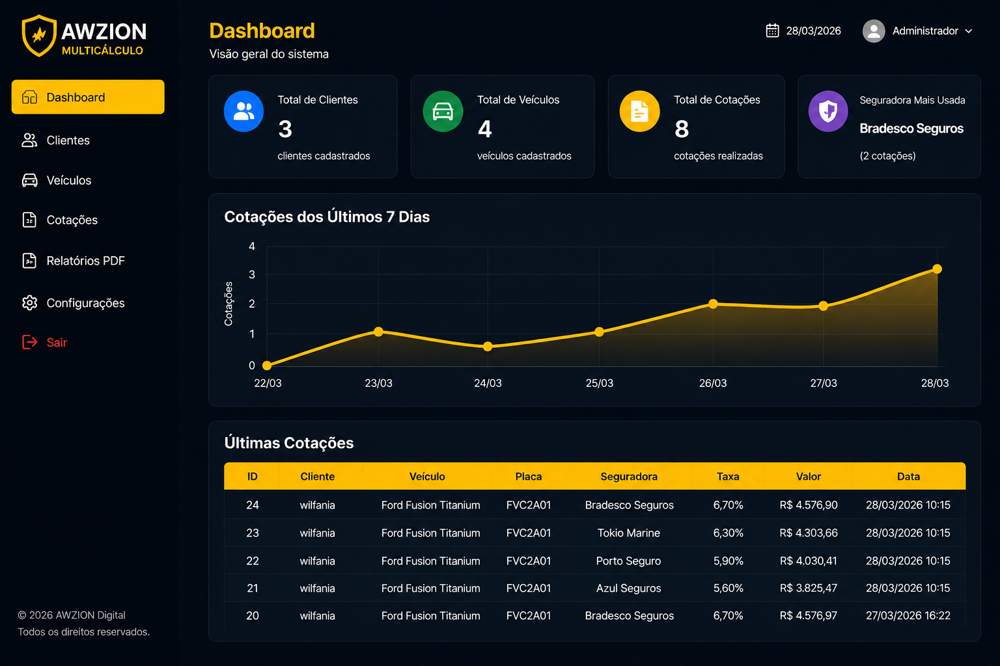
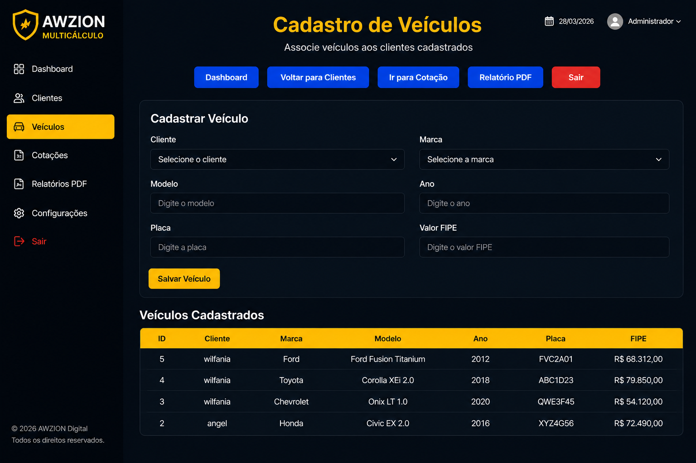
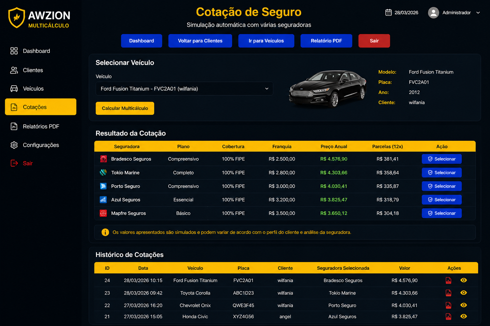
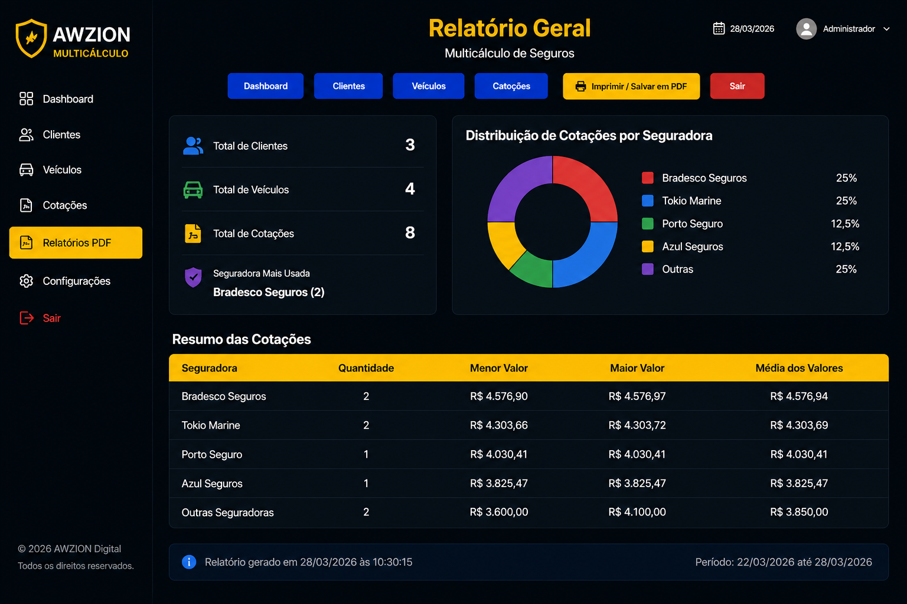

# 🚀 AWZION Multicálculo

Sistema profissional de Multicálculo de Seguros desenvolvido em PHP, MySQL e CSS moderno.

---

# 📌 Sobre o Projeto

O **AWZION Multicálculo** é uma plataforma criada para automatizar processos de cotação de seguros, oferecendo mais organização, velocidade e controle para corretores e empresas.

O sistema permite:

✅ Cadastro de clientes  
✅ Cadastro de veículos  
✅ Simulação automática de cotações  
✅ Relatórios em PDF  
✅ Dashboard administrativo  
✅ Controle completo de dados  
✅ Histórico de cotações  
✅ Interface responsiva  
✅ Painel moderno estilo SaaS  
✅ Sistema de login seguro  

---

# 🖥️ Screenshots do Sistema

## 📊 Dashboard


---

## 🚗 Cadastro de Veículos


---

## 💰 Sistema de Cotação


---

## 📑 Relatório Geral


---

# 🛠️ Tecnologias Utilizadas

- PHP
- MySQL
- HTML5
- CSS3
- JavaScript
- Git
- GitHub

---

# 📂 Estrutura do Projeto

```bash
📁 screenshots/
│
├── dashboard.png
├── cotacao.png
├── relatorio.png
└── veiculo.png

📄 auth.php
📄 cotacao.php
📄 painel.php
📄 index.php
📄 login.php
📄 logout.php
📄 relatorio.php
📄 style.css
📄 veiculo.php
📄 config.example.php
```

---

# 🔐 Segurança

O arquivo:

```php
config.php
```

não está incluído neste repositório por segurança.

Crie o arquivo baseado em:

```php
config.example.php
```

e configure:

```php
$dbHost
$dbName
$dbUser
$dbPass
```

---

# 🎯 Objetivo

Desenvolver uma solução moderna, profissional e escalável para o setor de seguros, facilitando o gerenciamento de clientes, veículos e cotações em um único sistema.

---

# 🌎 Desenvolvedor

👨‍💻 Angel Michael Nunez Medina  

🚀 Fundador da AWZION Digital  
📊 Ciência da Computação | Data Science & BI  
🌎 Brasil 🇧🇷 & República Dominicana 🇩🇴

---

# 🔥 Funcionalidades

- Login seguro
- Dashboard administrativo
- Cadastro de clientes
- Cadastro de veículos
- Controle de cotações
- Histórico completo
- Relatórios PDF
- Interface responsiva
- Sistema moderno black & gold
- Painel estilo SaaS

---

# 🚧 Projeto em evolução

Novas funcionalidades serão adicionadas futuramente:

- 🔄 Multiusuário
- 🔄 Dashboard avançado
- 🔄 API REST
- 🔄 Backup automático
- 🔄 App Mobile
- 🔄 Notificações
- 🔄 Relatórios inteligentes

---

# ⭐ Status do Projeto

✅ Em desenvolvimento ativo

---

# 📜 Licença

Este projeto é propriedade privada da AWZION Digital.

O uso, cópia, modificação ou distribuição sem autorização não é permitido.

© 2026 AWZION Digital. Todos os direitos reservados.
